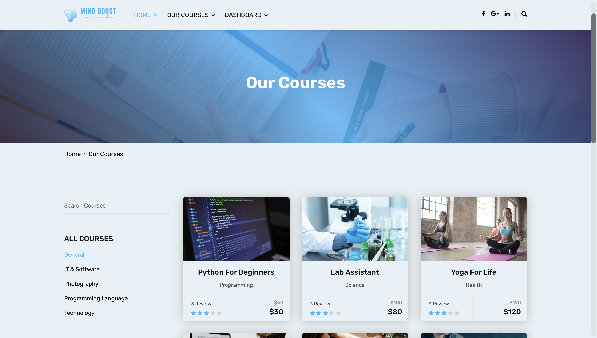
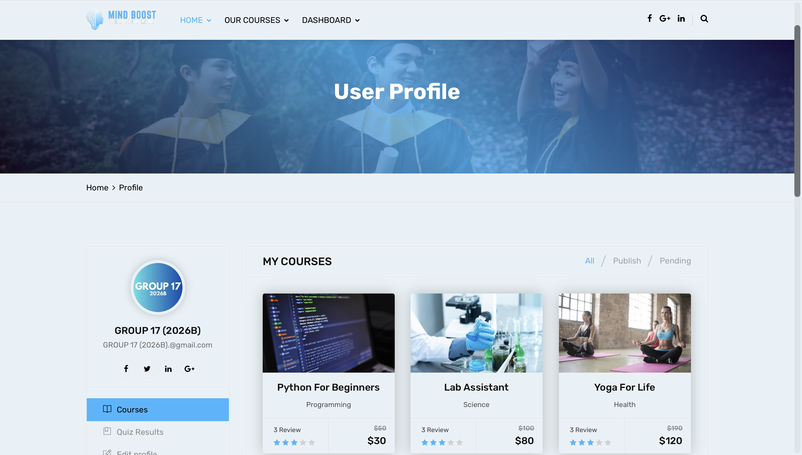
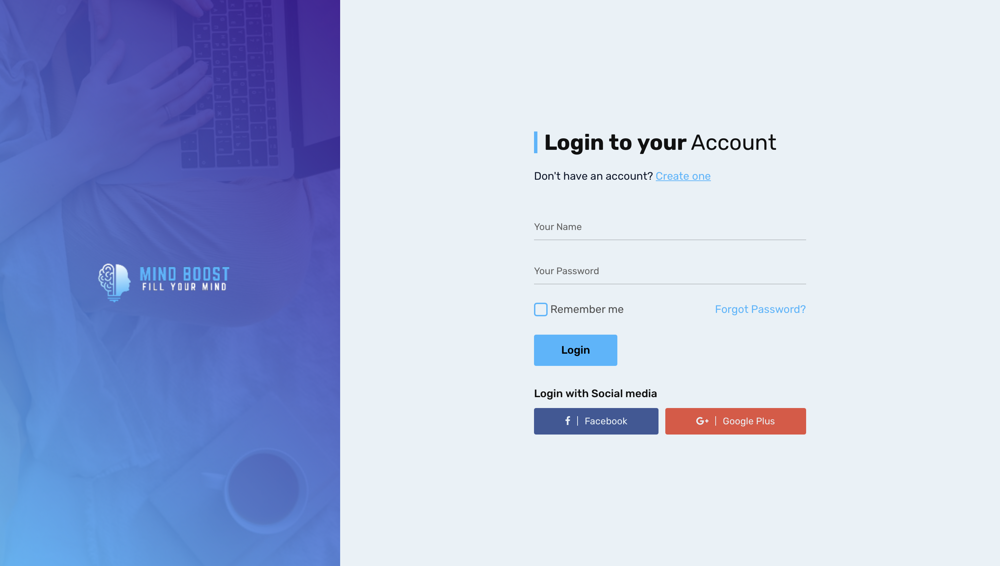

# 📚 MIND BOOST – Online Course Platform (UI Only)

## 📌 Overview

MIND BOOST is a **frontend (UI-only) web application** that simulates an online course platform.  
Users can browse courses, explore details, and experience a course selection and learning interface.

This project focuses on **UI/UX design, layout structuring, and responsive web development**.

---

## 🚀 Features

- 🏠 **Home Page**
  - Attractive landing page with banners and featured sections

- 📖 **Courses Page**
  - Browse courses with categories, pricing, and ratings

- 👤 **User Profile**
  - View enrolled courses (UI)
  - Edit profile and manage account (UI)

- 🔐 **Authentication UI**
  - Login and registration interfaces (non-functional)

- 🎯 **Responsive Design**
  - Fully responsive layout using Bootstrap
  - Clean navigation and modern UI components

---

## 📸 Screenshots

### 🏠 Home Page

### 📖 Courses Page

### 👤 User Profile

### 🔐 Login Page

---

## 🛠️ Technologies Used

- HTML5  
- CSS3  
- Bootstrap  
- JavaScript (jQuery)  
- Font Awesome  

---

## ▶️ How to Run

1. Download or clone the repository  
2. Open the project folder  
3. Open `index.html` or `home.html` in your browser  

---

## ⚠️ Important Notes

- This is a **UI-only project (frontend)**  
- No backend, database, or payment system is implemented  
- Login, registration, and course purchase are **design simulations only**  

---

## 🎯 Purpose

This project demonstrates:
- UI/UX design for an online course platform  
- Responsive web design principles  
- Structured layout using modern frontend tools  

---

## 📈 Future Improvements

- Add backend integration (Node.js / Firebase / Django)  
- Implement real authentication system  
- Add course enrollment and payment system  
- Improve interactivity with dynamic data  

---

## 📜 License

This project is created for educational purposes.

---

## 🌟 Final Note

This project highlights the design and structure of a modern **e-learning platform UI**, focusing on user experience and clean interface design.